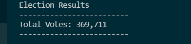

# pyPoll_challenge
# The purpose of the election audit
The purpose of the election audit is to have an automated election calculation system you that is free frpm human error.
# Election _Audit Results
## How many votes were cast in this congressional election?    

# This is a breakdown of the number of votes,percentage of votes for each county in the precinct. 
  

# The total number of vote cast was 369,711

![pyPoll challenge] (https://github.com/onehatt29/pyPoll_challenge/blob/main/ total candidate votes.PNG)

# Runners vote breakdown
## Charles Casper Stockham 23.0% (85,213)
## Diana Degette 73.8% (272,892)
## The winner of the election was Diana Degette with 272,892 votes. with a percentage of 73.8% of the votes.

# To the Election Commission 
## Based on the data collected from the election results we can see a breakdown of the votes broken down by county and candidate.
## The results were broken down by percentage and total votes these numbers will give any viewer a direct analysis of the vote results 
## This code cn be adjusted to include other voter data.
